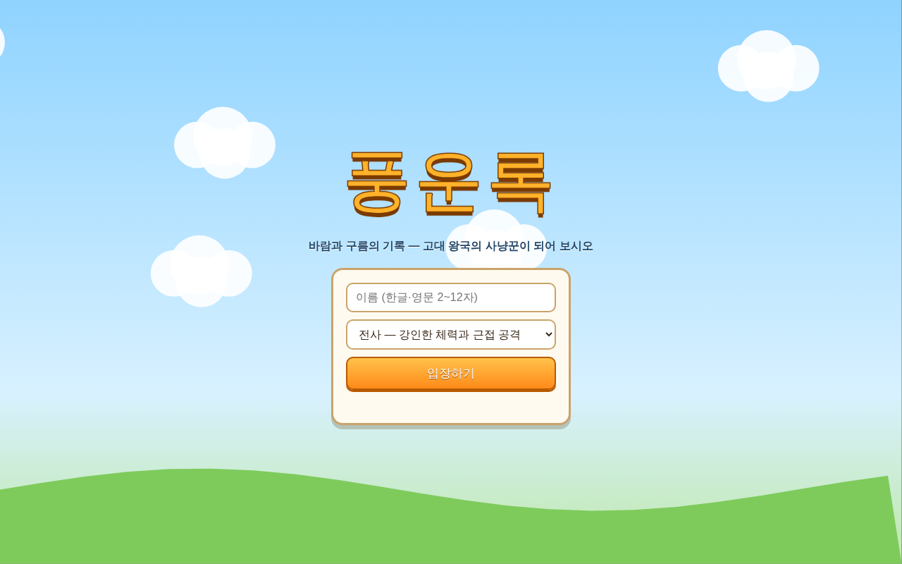
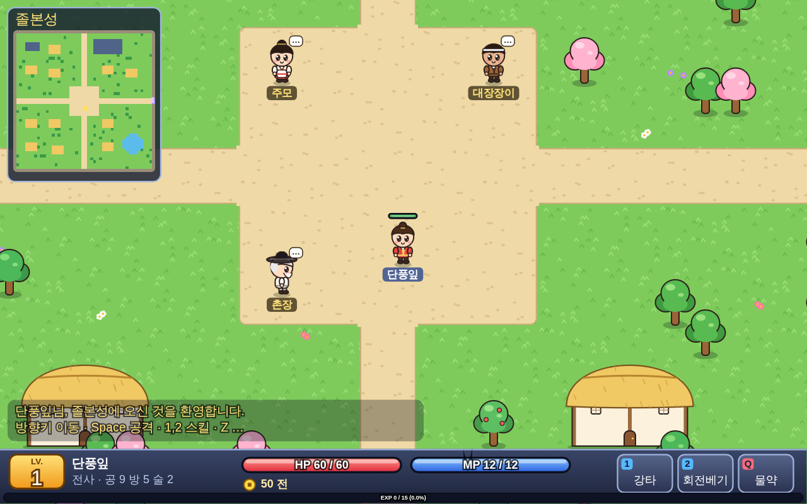
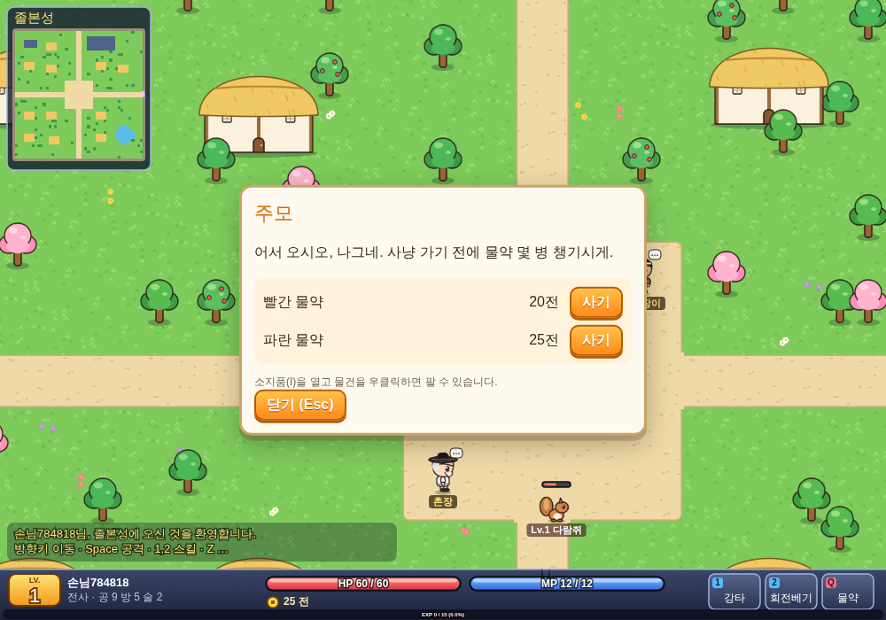

# 풍운록 (風雲錄)

고대 왕국을 배경으로 한 **탑뷰 2D 타일 멀티플레이 RPG**입니다. 브라우저에서 접속해 여럿이 같은 마을과 사냥터를 돌아다니며
사냥하고, 성장하고, 대화합니다. 그래픽은 외부 이미지 없이 모두 코드로 그립니다 — 굵은 외곽선과 밝은 색의 2등신 만화풍 캐릭터, 통통 튀는 몬스터, 테두리 있는 데미지 숫자, 미니맵과 하단 상태바.

| 시작 화면 | 졸본성 (마을) | 주모의 상점 |
|---|---|---|
|  |  |  |

## 실행 방법

필요한 것: Node.js 22 이상

```bash
npm install
npm run build
npm start                 # http://localhost:3000
```

| 환경변수 | 기본값 | 설명 |
|---|---|---|
| `PORT` | `3000` | 서버 포트 |
| `DATA_DIR` | `game/data` | 캐릭터 저장 폴더 (캐릭터당 JSON 파일 1개) |
| `TEST_HOOKS` | (끔) | `1`이면 E2E 테스트용 몬스터 소환 명령 허용. 운영에서는 켜지 마세요 |

**서버 없이 바로 해 보기**: `npm run build` 후 `dist/offline/pungunrok.html` 을 브라우저로 열면 1인용 판이 실행됩니다(게임 월드가 브라우저 안에서 돌고, 진행 상황은 그 브라우저에 저장).

게임 화면은 브라우저 창 전체를 채우며, 창을 키우면 화면도 함께 확대됩니다(가로 26칸·세로 16칸 이상 보이도록).

브라우저 여러 개(또는 시크릿 창)로 접속하면 서로의 캐릭터가 보입니다. 서버를 `Ctrl+C`/`SIGTERM`으로 끄면 접속 중인 캐릭터를 저장한 뒤 종료합니다.

### 개발용 명령

| 명령 | 내용 |
|---|---|
| `npm run maps` | 시드 고정 생성기로 `shared/maps/*.json` 재생성 |
| `npm run typecheck` / `npm run lint` | 타입 검사 / ESLint |
| `npm test` | 단위·통합·부하 테스트 (Vitest) |
| `npm run e2e` | Chromium으로 실제 플레이하는 E2E 테스트 (Playwright). 스크린샷은 `test-results/screens/` |
| `npm run verify` | typecheck → lint → build → test → e2e 를 모두 실행하고 `verify-report.json` 생성 |

## 조작법

| 키 | 동작 |
|---|---|
| 방향키 | 이동 (누르고 있으면 계속 이동) |
| `Space` / `Ctrl` | 바라보는 방향 공격 |
| `1`, `2` | 직업 스킬 |
| `Z` | 발밑·앞칸의 물건 줍기 |
| `T` | 가까운 NPC와 대화 (상점 열기) |
| `Q` | 물약 마시기 (체력·마력 중 더 부족한 쪽) |
| `I` | 소지품 창 (클릭: 사용/장착, 상점 대화 중 우클릭: 판매) |
| `Enter` | 채팅 입력 / 보내기 |
| `Esc` | 창 닫기 |

### 직업과 스킬

| 직업 | 특징 | 1번 스킬 | 2번 스킬 |
|---|---|---|---|
| 전사 | 높은 체력·방어 | 강타 (앞 칸 2배) | 회전베기 (주변 8칸) |
| 도적 | 높은 공격력 | 급소찌르기 (앞 칸 2.6배) | 비영보 (앞으로 3칸 도약) |
| 주술사 | 강한 술법 | 화염구 (직선 6칸 원거리) | 빙결진 (반경 2칸 광역) |
| 도사 | 치유·보조 | 치유 (자신+주변 3칸 동료) | 뇌격 (직선 4칸 원거리) |

### 세계

- **졸본성** (마을): 주모(물약), 대장장이(무기), 촌장. 동문으로 나가면 들판.
- **비류수 들판** (사냥터): 다람쥐 Lv1, 토끼 Lv2, 여우 Lv4(선공).
- **흑림 동굴** (사냥터): 늑대 Lv7, 곰 Lv10, 도깨비 Lv13 (모두 선공).

쓰러지면 3초 뒤 졸본성에서 부활하며, 다음 레벨까지 필요한 경험치의 5%를 잃습니다.

## 구조

```
game/
├── shared/            서버·클라이언트 공용 (순수 로직)
│   ├── types.ts       프로토콜 메시지 타입
│   ├── balance.ts     모든 밸런스 상수 (직업·스킬·아이템·몬스터)
│   ├── rules.ts       난수·데미지·경험치·능력치 계산 (순수 함수)
│   ├── validate.ts    클라이언트 메시지 스키마 검증
│   ├── mapgen.ts      시드 고정 맵 생성기
│   └── maps/*.json    생성된 맵 (타일 + 충돌 + 포털 + 스폰 + NPC)
├── server/
│   ├── world.ts       권위 게임 월드 (이동·전투·AI·아이템·상점) — 시간과 난수를 주입받는 상태 머신
│   ├── server.ts      HTTP(정적 파일, /health) + WebSocket(/ws), 10Hz 틱, 속도 제한, 자동 저장
│   ├── storage.ts     캐릭터 JSON 저장 (임시 파일 → rename 원자적 교체)
│   └── main.ts        진입점, SIGTERM 시 저장 후 종료
├── client/
│   ├── main.ts        네트워크·상태·캔버스 렌더링·HUD·UI
│   ├── sprites.ts     코드로 그리는 타일·건물·나무·캐릭터·몬스터·아이템 (3배 해상도 캐시)
│   ├── scenery.ts     맵에서 건물·나무·바위 개체와 길·물가 가장자리 추출 (순수 함수)
│   ├── camera.ts      카메라·이동 보간 (순수 함수)
│   ├── input.ts       키 → 동작 매핑 (순수 함수)
│   └── index.html
├── tests/             Vitest (AC 번호별 단위·통합·부하 테스트)
├── e2e/               Playwright E2E
└── scripts/           build.mjs, verify.mjs, genmaps.ts
```

```
 브라우저 (client)                        서버 (server)
┌──────────────────┐   {t:"move"...}   ┌───────────────┐  handle()  ┌──────────────┐
│ input.ts → send  │ ────────────────▶ │ server.ts     │ ─────────▶ │ world.ts     │
│                  │                   │ 검증·속도제한 │            │ 규칙·AI·전투 │
│ main.ts 렌더링   │ ◀──────────────── │ 10Hz 틱       │ ◀───────── │ snapshot()   │
└──────────────────┘ snapshot/self/fx  └──────┬────────┘   drain()  └──────────────┘
                                              │ 저장
                                        storage.ts → DATA_DIR/characters/*.json
```

서버가 모든 좌표·데미지·아이템 수량을 계산하고(권위 서버), 클라이언트는 입력만 보내고 받은 상태를 그립니다.

## 프로토콜 (WebSocket `/ws`, JSON)

클라이언트 → 서버: `login{name,job}`, `move{dir}`, `attack`, `skill{slot}`, `chat{text}`, `pickup`, `use{slot}`,
`unequip`, `talk`, `buy{npc,item,qty}`, `sell{npc,slot,qty}`

서버 → 클라이언트: `welcome{id,map,x,y,stats}`, `snapshot{map,players,monsters,items}`(틱마다), `self`(내 상태가 바뀔 때),
`chat{from,text}`, `dialog{npc,name,text,shop}`, `fx`(효과), `error{code,message}`

HTTP: `GET /health` → `{"ok":true}`, `GET /` → 클라이언트
